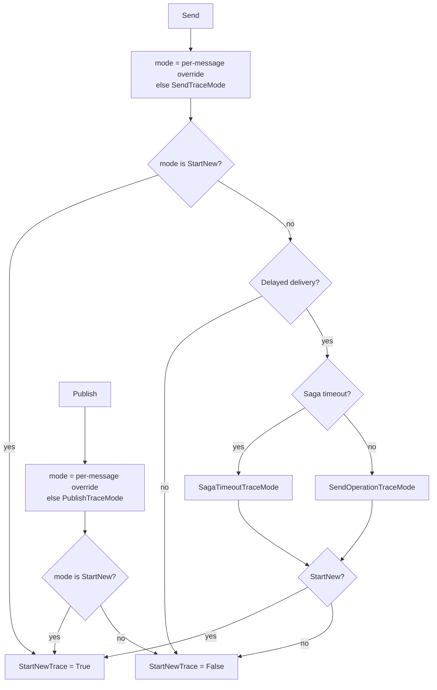

# The sender decides trace continuation, per endpoint, per path and per message

**Date:** 2026-07-15
**Pull request:** [#7867](https://github.com/Particular/NServiceBus/pull/7867) (send and publish defaults), [#7845](https://github.com/Particular/NServiceBus/pull/7845) (delayed messages)
**Related:**

- [#7049](https://github.com/Particular/NServiceBus/pull/7049) a new trace for delayed messages (2024)
- [#7936](https://github.com/Particular/NServiceBus/pull/7936) the v10 default for `PublishTraceMode`
- [#7229](https://github.com/Particular/NServiceBus/issues/7229) endpoint-wide continuation for publish
- [#7205](https://github.com/Particular/NServiceBus/issues/7205) opt out of a new trace for delayed messages
- [#7917](https://github.com/Particular/NServiceBus/pull/7917) writes the header only when it is `True`
- [2026-09-28 trace context is injected only in the outgoing pipeline](2026-09-28-trace-context-injected-only-in-outgoing-pipeline.md)

## Context

How the processing span of a receiver relates to the span of the outgoing operation was fixed per
operation:

| Operation | Receiver | Recorded reason |
|---|---|---|
| Send | child span, same trace | the request continues |
| Publish | new trace, link to the publish span | "safe by default": continuing on every subscriber can become costly and can break sampling (#7229) |
| Delayed send, saga timeout, delayed retry, move to error | new trace, link | supports sampling: a sampled-out parent would otherwise truncate the trace (#7049, #7205) |

The decision travels on the wire as the `NServiceBus.OpenTelemetry.StartNewTrace` header. The sending
endpoint stamps it. `ActivityFactory` on the receiver reads it. Per-message overrides existed in one
direction only: `SendOptions.StartNewTraceOnReceive()` and `PublishOptions.ContinueExistingTraceOnReceive()`.

Issue #7229 asks for an endpoint-wide setting for publish. Issue #7205 asks for an opt-out of the new
trace for delayed messages. Tools without span link support show such traces as broken.

"Delayed message" covers three paths with two deciders:

- delayed sends and saga timeouts: the sending endpoint, where a per-message override can exist;
- delayed retries and move to error: the recoverability of the processing endpoint, where no
  `SendOptions` exists.

Delayed retries also pass the routing stage with a delay set. A rule keyed on "has a delay" at that stage
sees both kinds.

## Decision

1. **A `TraceMode` enum** with `ContinueExisting` and `StartNew`. The names match the per-message
   methods.
2. **Endpoint defaults on `InstrumentationOptions`.** `SendTraceMode` defaults to `ContinueExisting`.
   `PublishTraceMode` defaults to `StartNew` in v10 and to `ContinueExisting` in v11.
3. **The per-message override wins.** `StartNewTraceOnReceive()` and `ContinueExistingTraceOnReceive()`
   exist on both `SendOptions` and `PublishOptions`. They write one context-bag value. The last call
   wins.
4. **Per-path settings for delayed messages.** `DelayedDelivery.SendOperationTraceMode`,
   `DelayedDelivery.SagaTimeoutTraceMode` and `Recoverability.DelayedRetryTraceMode`, all default
   `StartNew`. The v10 shape does not change.
5. **A delayed send ignores a per-message `ContinueExistingTraceOnReceive()`.** A per-message
   `StartNewTraceOnReceive()` still applies. The delayed setting is the only way to continue the trace
   of a delayed send. This keeps the v10 behavior for existing code.
6. **Move to error always starts a new trace.** It is not configurable.
7. **The decision is made before the routing stage.** `OpenTelemetrySendBehavior` and
   `OpenTelemetryPublishBehavior` stamp the header in the outgoing send and publish stages.
   `PopulateRecoverabilityTraceMetadataBehavior` writes it into the recoverability metadata, which
   `DelayedRetry` and `MoveToError` copy onto the headers. Metadata survives native dead-lettering.
8. **Replies carry no header.** The receiver continues the trace.
9. **Receivers do not reinterpret.** There is no receive-side setting.

## Consequences

- v11 changes the publish default to `ContinueExisting`. Subscribers then continue the trace of the
  publisher, and the sampling decision of the publisher applies to every subscriber. The pull request
  records the new default and not the reason. Open: confirm the v11 default and record the rationale
  before v11 ships. A user keeps the v10 shape with `PublishTraceMode = TraceMode.StartNew`.
- The header is written on every send and publish, also when it is `False`. A receiver treats an absent
  header as "continue", on v10 and on `master`. #7917 writes the header only when it is `True`.
- A receiver on an older version honors the header, because the header predates these settings.
- A `ContinueExistingTraceOnReceive()` on a delayed send is ignored without an error. Accepted for
  backward compatibility. The method documentation says so.
- An error queue message always starts a new trace on retry. A ServiceControl retry is a new trace that
  links to the original sender span.
- The setting names and the enum were renamed once during the work, from `TraceConnector`, `ChildSpan`,
  `SpanLink` and `SentMessageTraceConnector`. None of the old names shipped.

## Alternative approaches

The point of leverage is receive-side configuration. It would move the decision to the other party and
make the header advisory.

### Receive-side configuration

A receiver setting that ignores or overrides the header. Rejected. The sender holds the per-message
intent, and the header is the contract between versions. Two deciders for one message would conflict.

### Booleans or fluent methods instead of an enum

`ContinueTraceOnReceive = true` reads well for two states. But a boolean does not name the two shapes,
and a third state cannot be added. The enum names the shape. Rejected.

### A third mode `UseExisting`

Tried during the work on #7949 and not merged. See the
[ambient parent ADR](2026-09-23-trace-parent-header-and-ambient-parent.md).

### A behavior in the routing stage that decides for delayed messages

Implemented first. Both delayed retries and delayed sends carry a delay at that stage. The behavior told them
apart by the `DelayedRetries` header. Review moved the decisions before the routing stage,
into the send stage and into the recoverability metadata. There the origin of the message is known. The
routing stage is also shared with the forwarding paths, see the ADR of 2026-09-28.

### A configurable trace mode for move to error

`MoveToErrorTraceMode` was implemented and removed before merge, to simplify the options. The pull
request gives no further reason. The option can return when a user asks for it.

### Per-message overrides for delayed retries

No `SendOptions` exists for a retry. The recoverability setting is the only decider. Not possible.
