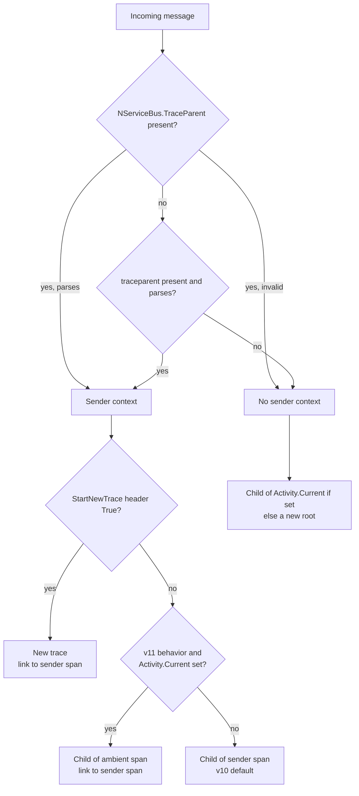

# NServiceBus writes its own trace parent header and parents on an ambient transport span

**Date:** 2026-09-23
**Pull request:** [#7947](https://github.com/Particular/NServiceBus/pull/7947) (header), [#7949](https://github.com/Particular/NServiceBus/pull/7949) (ambient parent)
**Related:**

- [2026-10-01 receive-side trace state and baggage propagation](2026-10-01-receive-side-trace-state-and-baggage-propagation.md)
- [2026-10-02 single switch for the v11 behaviors](2026-10-02-single-switch-for-v11-opentelemetry-behaviors.md)
- [docs.particular.net#8443](https://github.com/Particular/docs.particular.net/pull/8443) documentation for the `otel` branch

## Context

Azure Service Bus, RabbitMQ and Amazon SQS have OpenTelemetry instrumentation of their own, in the SDK or
in a contrib package. Two effects on NServiceBus traces were found.

**On send, the SDK can overwrite `traceparent`.** NServiceBus writes the context of its send or publish
span to the W3C `traceparent` header. RabbitMQ.Client 7 then injects the context of its own publish span
into the same header and overwrites it. The receiver parents its processing span on the SDK publish span.
The logical send-to-receive relation is lost. Azure.Core (verified in 7.20.1,
`MessagingClientDiagnostics`) does not overwrite an existing `traceparent`. The problem is SDK-specific,
but NServiceBus cannot know which SDK is in use.

**On receive, the SDK span is ambient but not the parent.** The SDK receive or process span is
`Activity.Current` when the NServiceBus incoming pipeline starts. NServiceBus created its incoming span as
a child of the sender span. With Azure Service Bus the NServiceBus span and the SDK process span are then
siblings under the send span. Users expect the NServiceBus span under the SDK span.

Before this change `ActivityFactory` also looked for a transport-supplied `Activity` in the `ContextBag`
of the message context. No transport supplies one. The Azure Service Bus, RabbitMQ, SQS, Learning and
acceptance testing transports do not touch `Activity` on receive. The path was not documented.

Constraints:

- The v10 trace shape must stay the default in a minor release. That shape is the incoming span as a
  child of the sender span.
- Rolling upgrades must work in both directions.
- The SDK context is the physical dispatch context, not the logical send context. They differ under the
  outbox, batched dispatch, the messaging bridge and ServiceControl retries.

## Decision

1. **A new header `NServiceBus.TraceParent`** (`Headers.NServiceBusDiagnosticsTraceParent`) carries the
   NServiceBus send or publish context in `traceparent` format. Senders write it on both propagation
   paths and keep writing the W3C `traceparent` too.
2. **Receivers prefer the NServiceBus header** and fall back to `traceparent`. A present but unparsable
   NServiceBus header does not fall back. The header is excluded from header-to-tag promotion, like the
   other diagnostics headers.
3. **Under the v11 behavior, an ambient activity becomes the parent.** When the message has NServiceBus
   trace context, `Activity.Current` is set, and the message does not start a new trace, the incoming
   span is created with a default parent context. The runtime then adopts `Activity.Current` as parent.
   The sender span becomes a link. Without an ambient activity the span is a child of the sender span as
   before. Until v11 this is behind the `NServiceBus.Core.OpenTelemetry.UseV11Behavior` switch.
4. **The `ContextBag` path is removed.** The receive `Activity` of a transport reaches NServiceBus as
   `Activity.Current`, nothing else.

## Consequences

- Every message carries two trace parent headers. The W3C header keeps older receivers and
  non-NServiceBus consumers working. Cost: about 55 bytes per message. Accepted; the headers of a
  message are several hundred bytes already. Open: whether a later version stops writing one of the
  two. Not decided here.
- A receiver on an older version reads only `traceparent`. For a message from a RabbitMQ sender it still
  sees the SDK publish span as parent. The fix needs both sides on 10.3 or later.
- Under the v11 behavior the sender span is a link, not the parent. This holds on every hop that has
  an SDK span. Backends without link support show the trace split at each hop. Accepted: the SDK span is the real
  parent of the processing work. A user who wants one trace can turn the SDK instrumentation off.
- Any ambient activity is adopted, whatever its kind or origin. Host code that wraps the message pump in
  its own activity makes that activity the parent. Accepted. The ADR of 2026-10-01 builds on this for
  baggage.
- Transports must pass the header through unchanged. It is a regular NServiceBus header, so the existing
  header mapping of each transport covers it.
- No acceptance test covers ambient parenting. Nothing in the acceptance suite creates `Activity.Current`
  at receive time, and the switch is process-wide. Unit tests on `ActivityFactory` cover both directions.
- Trace state and baggage under an ambient parent are decided in the ADR of 2026-10-01.
- Follow-up: the header and the behavior go on the docs.particular.net headers and OpenTelemetry pages
  (docs.particular.net#8443, in progress).

## Alternative approaches

The point of leverage is the sender-chosen `UseExisting` mode. It would move a fact of the receiver onto
the wire contract, and it returns whenever the trace shape is discussed from the sender side. It was
tried in unmerged work; internal working notes were consulted for it.

### Rely on the SDK leaving `traceparent` alone

Holds for Azure Service Bus, not for RabbitMQ.Client 7. NServiceBus cannot detect which SDK runs.
Rejected.

### Advise users to turn off the SDK instrumentation

Solves both effects, but removes the SDK spans users want, such as client latency and broker operations.
Rejected as the only answer. It stays a valid user choice.

### A third `TraceMode` value `UseExisting`, chosen by the sender

Tried during the work on #7949 and not merged. The sender decides the trace mode and stamps it in the
`StartNewTrace` header. But whether an SDK span exists is a fact of the receiver. A sender-side value for
a receiver-side fact leaks through the wire contract. It also adds a third header value that older
receivers treat as "continue". Rejected.

### Transports pass their receive `Activity` through the `ContextBag`

This was the existing path. Each transport has to change, while the SDK span is already
`Activity.Current`. Nobody used it. Removed.

### Write only the NServiceBus header

Older receivers and non-NServiceBus consumers read `traceparent`. Rejected.
