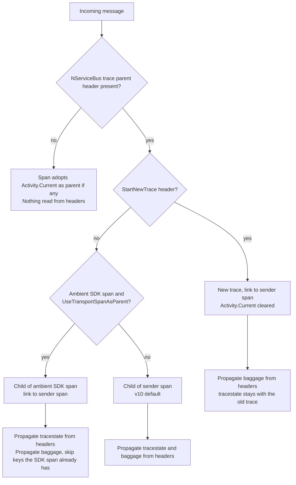

# NServiceBus propagates trace state and baggage on the receive side

**Date:** 2026-10-01
**Pull request:** [#7954](https://github.com/Particular/NServiceBus/pull/7954)
**Related:**

- [#7947](https://github.com/Particular/NServiceBus/pull/7947) NServiceBus-specific trace parent header
- [#7949](https://github.com/Particular/NServiceBus/pull/7949) ambient transport SDK span as parent
- [#7952](https://github.com/Particular/NServiceBus/pull/7952) propagation only in the outgoing pipeline

## Context

NServiceBus writes OpenTelemetry context to each outgoing message as headers. The headers are
`NServiceBus.TraceParent` and the W3C headers `traceparent`, `tracestate` and `baggage`. On receive,
`ActivityFactory` creates the incoming span in one of three shapes. Then it reads the headers back.

This record answers two questions:

- Who owns baggage on the receive side, now that transport SDKs have their own OpenTelemetry
  instrumentation?
- What happens when those SDKs start to propagate baggage?

Three sets of facts shaped the answer.

### How the .NET runtime reads baggage

`Activity.Baggage`, `Activity.GetBaggageItem` and `Activity.TraceStateString` all walk the
`Activity.Parent` chain. `Activity.Start()` sets `Parent` only in one case. The activity has no explicit
parent context, and `Activity.Current` is set at that moment.

An activity created from an `ActivityContext` gets the trace id and the parent span id. The trace tree is
correct. But `Parent` stays null. Such a span inherits no baggage, also when the context belongs to the
ambient `Activity.Current`. A small program against .NET 10 confirmed this: same trace id, same parent
span id, `Parent` null, baggage count zero.

So only two branches inherit the baggage of the ambient span. These are the branches that pass a default
parent context: the ambient SDK span as parent, and no sender context. The v10 default branch and the
start-new-trace branch do not inherit it. The runtime does not close that gap.

`Start()` sets `Parent`. So a check against the parent chain must run on a started activity. `SetIdFormat`
works only before `Start()`. On a started activity the runtime ignores it. The runtime throws and catches
an `InvalidOperationException` internally.

### What the transport SDKs do today

Verified against the SDK sources on 2026-09-30:

| SDK | Injects baggage on send | Extracts baggage on receive |
|---|---|---|
| Azure.Messaging.ServiceBus (`Azure.Core` `MessagingClientDiagnostics`) | no, only `Diagnostic-Id`, `traceparent`, `tracestate` | no |
| RabbitMQ.Client 7 (`RabbitMQActivitySource`) | yes, with `DistributedContextPropagator.Current.Inject`. It overwrites existing keys. | no, `DefaultContextExtractor` reads trace id and state only |
| AWS SDK for SQS | no tracing in the SDK. The OpenTelemetry contrib instrumentation uses `Baggage.Current`. That store is separate from `Activity.Baggage`. | same |
| SQL Server, MSMQ, Azure Storage Queues, Learning transport | no SDK tracing | no SDK tracing |

No supported SDK delivers baggage end to end. The one SDK that writes baggage does not read it. The header
that NServiceBus reads is always a superset of what an SDK receive span can carry. RabbitMQ basic headers
and Azure Service Bus application properties map one to one to NServiceBus headers.

### Constraints of the DistributedContextPropagator path

.NET 10 changed `DistributedContextPropagator.CreateDefaultPropagator()`. It now returns the W3C
propagator. The baggage header on that path is `baggage`, not `Correlation-Context`. `Inject` writes
`traceparent`, `tracestate` and `baggage` in one call. The runtime has W3C, pre-W3C, pass-through and
no-output propagators. It has no option to suppress baggage alone. To disable baggage on the outgoing
side, NServiceBus has two options. It can filter header names in the setter. Or it can write trace
context by hand again.

## Decision

1. **Trace state and baggage from the headers are propagated only when the message has NServiceBus trace
   context.** NServiceBus trace context is a parseable `NServiceBus.TraceParent` or `traceparent` header.
   The W3C specifications define `tracestate` and `baggage` as companions of `traceparent`. Without
   `traceparent`, NServiceBus has nothing of its own to propagate. The span adopts `Activity.Current` as
   parent if one exists. It inherits the trace state and baggage of that activity through the parent chain.

2. **NServiceBus always propagates the header baggage.** This includes the case where an ambient transport
   SDK span is the parent. No supported SDK propagates baggage. NServiceBus is the middleware, so it
   carries the baggage.

3. **When the ambient SDK span is the parent, NServiceBus skips a header key that the span already has.**
   This prepares for the future. When an SDK extracts baggage to its receive span, the parent gets the same
   items. Without the skip, the child would get them too. Outgoing serialization would write both. The next hop
   would double them again. The incoming activity is started before the headers are read. So the skip
   reads through the `Activity.Parent` chain of the runtime. NServiceBus does not track the adopted parent
   separately.

4. **Trace state from the headers is not propagated when the message starts a new trace.** `tracestate`
   carries vendor data about the trace of the sender, such as sampling decisions. A new trace has no
   relation to that data. The ambient-parent branch and the child-of-sender branch propagate trace state as
   before.

5. **Baggage is never copied from an ambient activity that does not become the parent.** Baggage on such an
   activity has one of two sources. It is from the same message, and the header already covers it. Or it is
   process-local context, and NServiceBus deliberately did not parent on it.

6. **Outgoing propagation does not change.** NServiceBus writes `baggage` together with its trace headers.

Mechanically, `ActivityFactory` creates the incoming activity, forces the W3C id format, adds the tags and
starts it. Only then does it read the headers. `ContextPropagation.PropagateContextFromHeaders` is split
into `PropagateTraceStateFromHeaders(activity, headers)` and `PropagateBaggageFromHeaders(activity,
headers)`. The split applies to both propagator paths, including the legacy path in `obsolete_v11.cs`.
Both methods expect a started activity. The combined method stays for callers that need both.

## Consequences

- Handlers can read message baggage with `Activity.Current.GetBaggageItem` on every transport. The
  transport SDK does not affect this. The v10 default branch did this before. The ambient-parent branch
  now guarantees it too.
- A `baggage` header on a message without a NServiceBus trace header is ignored. Accepted. A producer
  that wants its baggage honored must also send `traceparent`. The W3C specification requires this
  anyway. No NServiceBus version sent one header without the other.
- When the ambient SDK span is the parent, a key can exist on the span and in the header. The value
  on the span wins, because the header item is skipped. Accepted. Both values come from the same message,
  so they are the same in practice. The alternative doubles baggage per hop.
- Under the v10 default, the sender span is the parent. Process-local baggage that code around the
  message pump adds is then not visible to handlers. Accepted. This is consistent with not parenting on
  that activity. In v11 the ambient span becomes the parent, and the runtime inherits that baggage.
- Duplicate keys inside one `baggage` header are still added as before. The skip looks only at the parent
  chain, not at the activity itself. Legacy parsing does not change.
- Trace state needs no equal treatment. `TraceStateString` also reads through the parent chain. But it is
  a single value. The value of the child hides the value of the parent, so nothing accumulates.
- A message that starts a new trace drops the `tracestate` of the sender. Accepted. The value describes a
  trace that the new trace is deliberately detached from. The sender span is still reachable through the
  link.
- `ActivityFactory` starts the incoming activity before it returns it. The caller sets the display name
  after that. `ActivityListener.ActivityStarted` callbacks see the operation name and the tags, but not
  the display name. Exporters read the activity when it stops, so this is cosmetic.
- Cost: one `GetBaggageItem` lookup per header item. This applies only when the activity has a parent.
- Follow-up: document the receive-side behavior on the public OpenTelemetry page on docs.particular.net.
- Open: whether `InstrumentationOptions` needs an opt-out for baggage propagation. This record does not
  decide it.
- Open: when an SDK starts to extract baggage, verify the skip again against the real span.

## Alternative approaches

### Make NServiceBus baggage propagation opt-in and rely on the transport SDKs

The proposal: default on in the next minor, default off in v11. The assumption: the native SDK propagates
baggage. Rejected for four reasons:

- The assumption does not hold for any supported transport. See the table above.
- The SDK propagates the ambient context at physical dispatch, not the logical send context. These differ
  under the outbox, batched dispatch, the messaging bridge and ServiceControl retries. #7947 introduced
  `NServiceBus.TraceParent` for the same reason.
- Default off fails silently. Traces stay intact. Only downstream logic that reads baggage breaks.
- `DistributedContextPropagator.Inject` has no option to drop baggage alone.

### Copy the baggage of the ambient activity to the incoming span when it is not the parent

This was implemented first in this change, then reverted. Each source of ambient baggage on receive is one
of two things. It is the same message, where the header is a superset. Or it is process-local context that
NServiceBus chose not to parent on. The copy added allocations per message and a precedence rule for a
case that cannot occur.

### Add header baggage unconditionally, also under an ambient parent

This is the simplest reading of "NServiceBus always propagates baggage". Rejected. It doubles baggage on
each hop as soon as an SDK extracts baggage to the parent span. There is no error, and the headers grow.

### Skip all header baggage when the ambient parent has any baggage

Rejected. Unrelated baggage that host code adds would suppress the baggage of the message. The per-key
check costs the same and does not depend on the source of the baggage of the parent.
