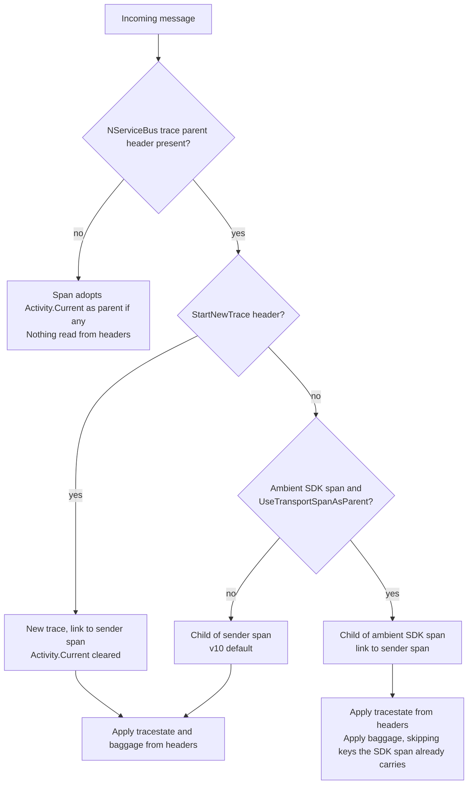

# Receive-side trace state and baggage propagation stays an NServiceBus responsibility

**Date:** 2026-10-01
**Pull request:** [#7954](https://github.com/Particular/NServiceBus/pull/7954)
**Related:** [#7947](https://github.com/Particular/NServiceBus/pull/7947) (NServiceBus-specific trace parent header), [#7949](https://github.com/Particular/NServiceBus/pull/7949) (ambient transport SDK span as parent), [#7952](https://github.com/Particular/NServiceBus/pull/7952) (propagation only in the outgoing pipeline)

## Context

NServiceBus writes OpenTelemetry context onto every outgoing message as headers: its own
`NServiceBus.TraceParent` plus the W3C `traceparent`, `tracestate` and `baggage` headers. On receive,
`ActivityFactory` creates the incoming span in one of three shapes and then reads those headers back.

The question this record answers is who owns baggage on the receive side now that transport SDKs
carry their own OpenTelemetry instrumentation, and what happens when those SDKs start to propagate
baggage themselves. Three sets of facts shaped the answer.

### How the .NET runtime reads baggage

`Activity.Baggage`, `Activity.GetBaggageItem` and `Activity.TraceStateString` all walk the
`Activity.Parent` object chain. `Parent` is only assigned by `Activity.Start()` when the activity was
created without an explicit parent context and `Activity.Current` was set at that moment. Creating an
activity from an `ActivityContext` fills in the trace id and parent span id, so the trace tree is
correct, but leaves `Parent` null. A span created that way inherits no baggage, even when the context
passed in belongs to the ambient `Activity.Current`. This was verified with a small program against
.NET 10: same trace id, same parent span id, `Parent` null, baggage count zero.

Consequently only the two branches that pass a default parent context (ambient SDK span as parent, and
no sender context) inherit the ambient span's baggage. The v10 default branch and the start-new-trace
branch do not, and nothing in the runtime bridges that gap.

### What the transport SDKs do today

Verified against the SDK sources on 2026-09-30:

| SDK | Injects baggage on send | Extracts baggage on receive |
|---|---|---|
| Azure.Messaging.ServiceBus (`Azure.Core` `MessagingClientDiagnostics`) | no, only `Diagnostic-Id`, `traceparent`, `tracestate` | no |
| RabbitMQ.Client 7 (`RabbitMQActivitySource`) | yes, via `DistributedContextPropagator.Current.Inject`, overwriting existing keys unconditionally | no, `DefaultContextExtractor` reads trace id and state only |
| AWS SDK for SQS | no tracing in the SDK; the OpenTelemetry contrib instrumentation uses OpenTelemetry's `Baggage.Current`, a store separate from `Activity.Baggage` | same |
| SQL Server, MSMQ, Azure Storage Queues, Learning transport | no SDK tracing | no SDK tracing |

So no supported SDK delivers baggage end to end, and the one that writes it does not read it. The
header NServiceBus reads is always a superset of what an SDK receive span could carry, because RabbitMQ
basic headers and Azure Service Bus application properties map one to one onto NServiceBus headers.

### Constraints on the DistributedContextPropagator path

.NET 10 changed `DistributedContextPropagator.CreateDefaultPropagator()` to return the W3C propagator,
so the baggage header on that path is `baggage`, no longer `Correlation-Context`. `Inject` writes
`traceparent`, `tracestate` and `baggage` in one call. The runtime offers W3C, pre-W3C, pass-through
and no-output propagators, but no way to suppress baggage alone. Disabling baggage on the outgoing side
would therefore mean filtering header names in the setter or hand-rolling trace context again.

## Decision

1. **Trace state and baggage from the headers are applied only when the message carries NServiceBus
   trace context**, that is a parseable `NServiceBus.TraceParent` or `traceparent` header. The W3C
   specifications define `tracestate` and `baggage` as companions of `traceparent`. Without it there is
   nothing of NServiceBus' own to propagate. The span adopts `Activity.Current` as parent if one exists
   and inherits that activity's trace state and baggage through the runtime's parent chain.

2. **NServiceBus always applies the header baggage, also when an ambient transport SDK span is the
   parent.** No supported SDK propagates baggage, so NServiceBus, as the middleware, carries it.

3. **When the ambient SDK span becomes the parent, a header key the span already carries is skipped.**
   This is forward-looking. Once an SDK extracts baggage onto its receive span, the same items would
   otherwise sit on both the child and the parent, outgoing serialization would write both, and the next
   hop would double them again. The skip is checked against the ambient activity directly because
   `Parent` is not assigned until `Start()`.

4. **Baggage is never copied from an ambient activity that does not become the parent.** Any baggage on
   such an activity is either from the same message, which the header already covers, or process-local
   context that NServiceBus deliberately did not parent on.

5. **Outgoing propagation is unchanged.** NServiceBus keeps writing `baggage` alongside its trace
   headers.

Mechanically, `ContextPropagation.PropagateContextFromHeaders` is split into
`PropagateTraceStateFromHeaders` and `PropagateBaggageFromHeaders(activity, headers, parent)` on both
propagator paths, including the legacy one in `obsolete_v11.cs`. The combined method remains for
callers that need both.

## Consequences

- Handlers can read message baggage through `Activity.Current.GetBaggageItem` on every transport,
  independent of what the transport SDK does. This is unchanged for the v10 default branch and newly
  guaranteed for the ambient-parent branch.
- A `baggage` header on a message without a NServiceBus trace header is ignored. Accepted: a producer
  that wants baggage honoured has to send `traceparent` as well, which the W3C specification requires
  anyway. No NServiceBus version ever sent one without the other.
- When the ambient SDK span is the parent and a key exists both on it and in the header, the span's
  value wins because the header item is skipped. Accepted: both come from the same message, so the
  values coincide in practice, and the alternative doubles baggage per hop.
- Process-local baggage added by code wrapping the message pump is not visible to handlers under the v10
  default, where the sender span is the parent. Accepted as consistent with not parenting on that
  activity. In v11 the ambient span becomes the parent and the runtime inherits it.
- Duplicate keys within a single `baggage` header are still added as they were. The skip only looks at
  the adopted parent, so legacy parsing behaviour is unchanged.
- Trace state needs no equivalent treatment. `TraceStateString` also reads through the parent chain, but
  it is a single value and the child's shadows the parent's, so nothing accumulates.
- Cost: one `GetBaggageItem` lookup per header item, only when an adopted parent exists.
- Follow-up: document the receive-side behaviour on the public OpenTelemetry page on docs.particular.net.
  Whether an opt-out for baggage propagation should exist on `InstrumentationOptions` remains open and is
  not decided here. When an SDK starts extracting baggage, re-verify the skip against the real span.

## Alternative approaches

### Make NServiceBus baggage propagation opt-in and rely on the transport SDKs

Proposed as default-on in the next minor and default-off in v11, on the assumption that the native SDK
propagates baggage. Rejected because the assumption does not hold for any supported transport, see the
table above, and because the SDK propagates the ambient context at physical dispatch rather than the
logical send context. Those differ under the outbox, batched dispatch, the messaging bridge and
ServiceControl retries, the same reason #7947 introduced `NServiceBus.TraceParent`. Default-off would
also fail silently: traces stay intact and only downstream logic that reads baggage breaks. Finally,
`DistributedContextPropagator.Inject` offers no way to drop baggage alone.

### Copy the ambient activity's baggage onto the incoming span when it is not the parent

Implemented first in this change and reverted. Every source of ambient baggage on receive is either the
same message, where the header is a superset, or process-local context NServiceBus chose not to parent
on. The copy added allocations per message and a precedence rule for nothing that can occur.

### Add header baggage unconditionally, also under an ambient parent

The simplest reading of "NServiceBus always applies baggage". Rejected because it doubles baggage on
every hop as soon as an SDK extracts baggage onto the parent span, with no error and growing headers.

### Skip header baggage entirely when the ambient parent carries any baggage

Rejected because unrelated baggage added by host code would suppress the message's baggage. The per-key
check is as cheap and does not depend on where the parent's baggage came from.
