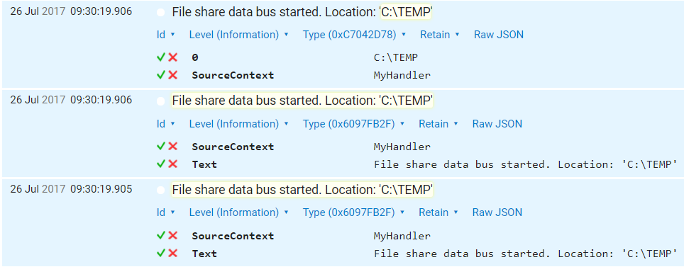

## Language Features
It is acceptable to use language features in C# 7.0 and lower versions.

## Performance related

For public facing interfaces we favor read-only collections and enumerables. For internal types we favor speed and allocation reduction. Avoid using collection interfaces internally.

### In hot paths

* Avoid allocations
* Avoid using `System.Linq`
* Avoid using `foreach` over collections that do not have a struct enumerator


## Don't use string interpolation for logging

By using string interpolation it is impossible for logging frameworks that support structured logging to distinguish values within the string. We must use the normal argument based overload so logging frameworks like Serilog can capture structured data.

Wrong:

```c#
// Concatenation
logger.Info("File share data bus started. Location: '" + basePath + "'");"
// Interpolation
logger.Info($"File share data bus started. Location: '{basePath}'");"
```

Right:

```c#
// Arguments
logger.InfoFormat("File share data bus started. Location: '{0}'", basePath);
```

This way Serilog stores the arguments seperately from the format string so that it is possible to filter/query on the argument values.



The first line is the usage of arguments, the second and third are the usage of string interpolation and concatenation.


## Wrap arguments ticks / apostrophe characters in log events

In order for logging frameworks like Splunk to have an easy way to do field extraction try to wrap arguments between ticks / apostrophe characters.

Wrong:

```c#
logger.InfoFormat("File share data bus started. Location: {0}", basePath);
```

Right:

```c#
logger.InfoFormat("File share data bus started. Location: '{0}'", basePath);
```


